# AI Product Discovery Workflow Skill with Multi-Agent Governance and Quantitative Evals

`zero-to-one-product-discovery` 是一个面向早期产品想法的 AI workflow skill：从一句模糊想法开始，逐步完成问题澄清、材料吸收、MVP 假设、规划产物和实施准备。

它适合新产品、新功能、内部工具、业务创新项目、side project 和 startup MVP 的早期探索。核心目标不是"快速套一个 PRD 模板"，而是防止 AI 在证据不足时过早进入 PRD、Roadmap、ADR 或编码阶段。

> Status: `v0.4.0-rc.4 Control Surface Hardening RC`。这是可安装、可展示的 release-candidate 版本：在 `v0.4.0-rc.3` 的 bounded Artifact Revision Ledger 基础上，新增 Controller action registry、Workbench 原子持久化脚本、Evidence Snapshot 一致性校验和 Artifact Export guardrails；仍不声明 release-grade validation、production stability 或跨模型全面优越性。

## Current Evidence Snapshot

2026-06 Codex 证据链重跑基于手册重新执行 Phase 1-6，旧 Claude Code 材料只做历史归档，不作为主证据。

| Evidence | Result | What It Supports |
|---|---|---|
| Quality Tests | `./tests/run_tests.sh unit` -> 71 tests passed | 本地 schema、状态、导出、执行交接和 revision ledger 边界可被机械验证 |
| Real Usability Tests | DeepSeek `deepseek-v4-flash` 跑通 6/6 条 P0 路径 | P0 主路径在真实 API 下行为层可用；P0_004 仍只声明为规划前澄清通过 |
| Main Benchmark | 5 个真实 API 任务：Tool 87.2 / Baseline 71.7，delta +15.5 | 当前任务集下，Z2O 比同模型裸对话更稳定地保留阶段门禁、证据标签和边界控制 |
| BM_004_v2 addendum | Tool 95.6 / Baseline 35.0，delta +60.6 | 当完整 child-skill / adapter / routing reference 启用时，Tool 更稳定地产出可审计 contract 字段 |

Boundary: 以上结论限定在当前任务集和本次 DeepSeek 运行条件下，不代表 release-grade validation、长期真实用户留存、商业化验证或跨模型全面优越性。BM_004 v1 打平、BM_005 盲评偏 Baseline 均保留为后续迭代证据。

## 用户路径图：P0 主流程

下图展示用户从模糊想法进入产品发现，到证据推进、阶段门禁、规划产物和可审计导出的 P0 主路径。核心设计点是：证据不足时降级或补证据，而不是把草稿包装成 final。

```mermaid
%% 本图覆盖：P0_001, P0_002, P0_003, P0_004, P0_005, P0_006
flowchart LR
    IDEA_START([用户带着早期想法])
    MATERIAL_CHECK{已有材料？}
    DIAGNOSTIC[生成事实/假设/风险/未知]
    MATERIAL_REVIEW[吸收材料并识别矛盾]
    KEY_QUESTION[提出一个关键问题]
    USER_ANSWER[用户补充证据]
    ARTIFACT_REQUEST{请求成熟产物？}
    GATE_CHECK{证据足够？}
    DOWNGRADE[降级为大纲或决策面]
    PLANNING_ARTIFACT[生成带证据标签的规划产物]
    READINESS_CHECK{进入执行计划？}
    IMPLEMENTATION_PLAN[生成实现计划]
    CONTROL_VIEW[查看证据/风险/准备度]
    EXPORT_REQUEST{请求导出？}
    EXPORT_PACKAGE[生成可审计交付包]
    NOT_READY[未就绪产物标记 NOT_READY]
    USER_RECOVER[用户补证据或接受草稿]
    SAFE_OUTCOME((可控可复盘产出))

    subgraph P0_MAIN["P0 主流程"]
      direction LR
      IDEA_START --> MATERIAL_CHECK
      MATERIAL_CHECK -->|无材料| DIAGNOSTIC
      MATERIAL_CHECK -->|有材料| MATERIAL_REVIEW
      DIAGNOSTIC --> KEY_QUESTION
      MATERIAL_REVIEW --> KEY_QUESTION
      KEY_QUESTION --> USER_ANSWER
      USER_ANSWER --> ARTIFACT_REQUEST
      ARTIFACT_REQUEST -->|是| GATE_CHECK
      ARTIFACT_REQUEST -.->|先看状态| CONTROL_VIEW
      GATE_CHECK -->|不足| DOWNGRADE
      DOWNGRADE --> USER_RECOVER
      USER_RECOVER --> USER_ANSWER
      GATE_CHECK -->|足够| PLANNING_ARTIFACT
      PLANNING_ARTIFACT --> READINESS_CHECK
      READINESS_CHECK -->|不足| CONTROL_VIEW
      READINESS_CHECK -->|足够| IMPLEMENTATION_PLAN
      CONTROL_VIEW --> KEY_QUESTION
      IMPLEMENTATION_PLAN --> EXPORT_REQUEST
      PLANNING_ARTIFACT --> EXPORT_REQUEST
      EXPORT_REQUEST -->|是| EXPORT_PACKAGE
      EXPORT_PACKAGE --> NOT_READY
      EXPORT_PACKAGE --> SAFE_OUTCOME
      NOT_READY -.-> USER_RECOVER
    end

    classDef main fill:#dbeafe,stroke:#3b82f6,color:#111827
    classDef decision fill:#fef9c3,stroke:#ca8a04,color:#111827
    classDef error fill:#fee2e2,stroke:#ef4444,color:#111827
    classDef success fill:#dcfce7,stroke:#22c55e,color:#111827

    class IDEA_START,DIAGNOSTIC,MATERIAL_REVIEW,KEY_QUESTION,USER_ANSWER,DOWNGRADE,PLANNING_ARTIFACT,IMPLEMENTATION_PLAN,CONTROL_VIEW,EXPORT_PACKAGE,USER_RECOVER main
    class MATERIAL_CHECK,ARTIFACT_REQUEST,GATE_CHECK,READINESS_CHECK,EXPORT_REQUEST decision
    class NOT_READY error
    class SAFE_OUTCOME success
```



## 项目架构图

下图展示 Z2O 的顶层控制架构：用户只看到一个主 workflow，内部通过 Controller、Producer、Auditor、Workbench、合约层和测试层共同约束产物升级、导出和执行交接。

```mermaid
%% 本图覆盖：zero-to-one-product-discovery 顶层架构
flowchart TD
    USER["用户"]
    HOST["Codex / Claude 宿主"]
    OPENAI_METADATA["Codex 元数据"]

    MAIN_SKILL["Skill 主工作流"]
    STAGE_GATES{"阶段门禁规则"}
    CONTROLLER{"Controller 路由权威"}
    WORKBENCH[("Runtime Workbench")]

    PRODUCERS["Producer 角色组"]
    AUDITOR["Auditor 审查角色"]
    CHILD_ADAPTERS["13 个 Child Adapters"]

    ARTIFACT_EXPORT["Artifact Export"]
    EXECUTION_BRIDGE["Execution Bridge"]
    REVISION_TRACE["Revision Trace"]

    EVAL_SCHEMAS["JSON Schema 合约层"]
    CONTROLLER_ACTIONS["Controller Actions 注册表"]
    SCRIPTS["Python 验证/写入脚本"]
    UNIT_TESTS["Unit Tests"]
    INTEGRATION_API["Integration API Layer"]
    NEW_BENCHMARK["Codex 新 Benchmark Runner"]
    OLD_BENCHMARK_ARCHIVE["Claude Code 旧 Benchmark 归档"]

    DEEPSEEK_API(["DeepSeek API"])
    MIMO_API(["Mimo API"])
    GITHUB_JIRA(["GitHub / Jira"])
    FILE_SYSTEM[("文件系统")]
    STATE_STORE[(".z2o-state / .z2o-patterns")]
    ARTIFACT_STORE[("z2o-artifacts")]
    EVIDENCE_PACKAGE[("桌面证据包")]
    VENDOR_SOURCES["Vendor Source Snapshots"]

    subgraph INTERFACE["接入层"]
      direction LR
      USER
      HOST
      OPENAI_METADATA
    end

    subgraph CORE["核心控制层"]
      direction LR
      MAIN_SKILL
      STAGE_GATES
      CONTROLLER
      WORKBENCH
    end

    subgraph CAPABILITY["产物能力层"]
      direction LR
      PRODUCERS
      AUDITOR
      CHILD_ADAPTERS
    end

    subgraph EXPORT_AUDIT["导出与审计层"]
      direction LR
      ARTIFACT_EXPORT
      EXECUTION_BRIDGE
      REVISION_TRACE
    end

    subgraph CONTRACT_TEST["合约与测试层"]
      direction LR
      EVAL_SCHEMAS
      CONTROLLER_ACTIONS
      SCRIPTS
      UNIT_TESTS
      INTEGRATION_API
      NEW_BENCHMARK
      OLD_BENCHMARK_ARCHIVE
    end

    subgraph EXTERNAL_STORAGE["外部与存储层"]
      direction LR
      DEEPSEEK_API
      MIMO_API
      GITHUB_JIRA
      FILE_SYSTEM
      STATE_STORE
      ARTIFACT_STORE
      EVIDENCE_PACKAGE
      VENDOR_SOURCES
    end

    USER --> HOST
    OPENAI_METADATA --> HOST
    HOST --> MAIN_SKILL
    MAIN_SKILL --> STAGE_GATES
    STAGE_GATES --> CONTROLLER
    CONTROLLER --> PRODUCERS
    CONTROLLER --> AUDITOR
    CONTROLLER --> CHILD_ADAPTERS
    CONTROLLER -->|读写当前状态| WORKBENCH
    PRODUCERS --> AUDITOR
    AUDITOR --> CONTROLLER
    CHILD_ADAPTERS --> ARTIFACT_EXPORT
    CHILD_ADAPTERS --> EXECUTION_BRIDGE
    CHILD_ADAPTERS --> REVISION_TRACE
    ARTIFACT_EXPORT -->|风险：写入交付包| ARTIFACT_STORE
    REVISION_TRACE -->|风险：写入变更账本| ARTIFACT_STORE
    EXECUTION_BRIDGE -.->|风险：dry-run 边界| GITHUB_JIRA
    WORKBENCH -->|风险：持久化| STATE_STORE
    SCRIPTS -->|风险：写入校验| STATE_STORE
    SCRIPTS -->|风险：写入校验| ARTIFACT_STORE
    EVAL_SCHEMAS --> SCRIPTS
    CONTROLLER_ACTIONS --> CONTROLLER
    CONTROLLER_ACTIONS --> EVAL_SCHEMAS
    UNIT_TESTS --> SCRIPTS
    INTEGRATION_API -.->|风险：真实 API| DEEPSEEK_API
    INTEGRATION_API -.->|风险：fallback| MIMO_API
    NEW_BENCHMARK -.->|风险：真实 API| DEEPSEEK_API
    NEW_BENCHMARK -.->|风险：fallback| MIMO_API
    NEW_BENCHMARK -->|写入新证据| EVIDENCE_PACKAGE
    OLD_BENCHMARK_ARCHIVE -->|仅归档| EVIDENCE_PACKAGE
    VENDOR_SOURCES -.-> CHILD_ADAPTERS
    FILE_SYSTEM --> STATE_STORE
    FILE_SYSTEM --> ARTIFACT_STORE
    FILE_SYSTEM --> EVIDENCE_PACKAGE

    classDef core fill:#dbeafe,stroke:#3b82f6,color:#111827
    classDef shared fill:#ede9fe,stroke:#8b5cf6,color:#111827,stroke-width:2px
    classDef external fill:#fef3c7,stroke:#f59e0b,color:#111827
    classDef storage fill:#dcfce7,stroke:#22c55e,color:#111827
    classDef harness fill:#f1f5f9,stroke:#64748b,color:#111827
    classDef risk fill:#fee2e2,stroke:#ef4444,color:#111827,stroke-width:2px

    class USER,HOST,OPENAI_METADATA core
    class MAIN_SKILL,STAGE_GATES,CONTROLLER core
    class WORKBENCH shared
    class PRODUCERS,AUDITOR,CHILD_ADAPTERS shared
    class ARTIFACT_EXPORT,EXECUTION_BRIDGE,REVISION_TRACE risk
    class EVAL_SCHEMAS,CONTROLLER_ACTIONS,SCRIPTS,UNIT_TESTS harness
    class INTEGRATION_API,NEW_BENCHMARK risk
    class OLD_BENCHMARK_ARCHIVE harness
    class DEEPSEEK_API,MIMO_API,GITHUB_JIRA,VENDOR_SOURCES external
    class FILE_SYSTEM,STATE_STORE,ARTIFACT_STORE,EVIDENCE_PACKAGE storage
```



## Highlights

### 核心架构

- **Stage-gated workflow**：由 `SKILL.md` 控制阶段门禁、上下文连续性、子能力路由和最终输出验收。
- **Multi-agent governance**：Workflow 规则负责阶段门禁，Controller Agent 负责路由，Producer Agents 负责产物，Auditor Agent 负责独立审核，Runtime Workbench 只保存当前决策状态；Agent Work Order / Return Packet / Audit Report / Workbench / Pattern Index / Artifact Manifest / Execution Handoff / Revision Index / Revision Record 有 strict JSON Schema 作为 release-check 层。
- **Quantitative evals**：包含 strict suite、Windows relay、targeted rerun、Baseline A/B、P0/P1/P2 RC scenarios、hard failures、Value Gate 和机器可读 schema。
- **中文优先体验**：默认面向中文产品探索和协作场景，同时保留英文 artifact 名称以兼容常见 PM / engineering 术语。

### P0：基础能力

- **Auto-Persist Runtime Workbench**：每次 stage 转换自动保存状态到 `.z2o-state/workbench.json`，新 session 自动恢复（7 天有效期）。消除 8-stage 长流程的 session 断裂风险。
- **Quick Mode**：独立模式开关，可在任意 stage 激活。跳过交互式探索循环，直接产出带 evidence labels 的 draft（`[Fact]` / `[Assumption]` / `[Unknown]`），附 Evidence Gap Summary。
- **Execution Bridge Host Handoff**：把 review-ready Implementation Plan 转为 host-executable dry-run handoff。GitHub Issues 是 P0 目标格式；Claude Code tasks / Jira tickets 保留格式转换。Z2O 不直接创建外部 issue/ticket。
- **Artifact Export**：稳定导出 PRD / Roadmap / User Stories / Implementation Plan / Workbench / Execution Handoff 文件结构到 `z2o-artifacts/<project-slug>/`。缺失产物保留固定文件位并标记 `NOT_READY`。
- **Artifact Revision Ledger**：为已导出的稳定产物生成 bounded revision trace：hash、unified diff、section summary、Controller decision、evidence refs、decision refs、audit refs 和 change rationale。它不进入 Workbench，不保存完整对话或完整 agent packets。
- **Control Surface Hardening**：Controller actions 由 `evals/controller-actions.json` 统一管理；Workbench 写入通过 schema + evidence summary 校验和原子 replace；Artifact Manifest 记录 `source_status`、`content_mode`、`status_guard`，防止 Quick Mode draft 或 outline 被误读为 final。

### P1：差异化能力

- **Evidence Maturity Dashboard**：实时查看 evidence 验证进度。四级标签（Insufficient / Partial / Sufficient / Strong），只有 verified facts 算"成熟"。用户说"evidence dashboard"或"证据成熟度"即可查看。
- **File Workbench**：用户说"工作台"或"workbench"即可查看 current-state dashboard；用户说"导出工作台"即可导出 Markdown/JSON 工作台视图。
- **Assumption → Validation Plan 绑定**：每个 assumption 可关联 experiment design、success criteria、timeline。Dashboard 可追踪所有 validation plan 的进度。
- **Express Review**：Material Assimilation 阶段的快速审视路径。一键批量接受 extraction 结果，仅对 contradictions 进行确认。与 Quick Mode 的区别：Express Review 只加速材料讨论，Quick Mode 跳过整个探索循环。

### P2：护城河能力

- **Risk Map**：每份 PRD 自带风险地图。每个 assumption 有 impact_if_wrong 评估（low / medium / high / critical），按 risk_weighted_priority 排序。用户说"risk map"或"风险地图"即可查看。
- **Readiness Spectrum**：从二元判定（能/不能写 PRD）升级为连续的 readiness score（0.0-1.0）。显示 gap analysis 和 fastest validation path，告诉你"差多少、怎么补、多快能到"。
- **Pattern Library**：从已完成的 discovery 项目自动沉淀 evidence pattern、decision pattern、stage gate pattern。新项目启动时自动匹配并建议参考。

### 基础特性

- **一轮一个关键问题**：每轮只问当前最高杠杆问题；用户回答后再更新 facts / assumptions / risks / gaps。
- **防止过早产物化**：信息不足时只能输出 outline、decision surface、evidence gap 或 blocking question，不能伪造成最终 PRD。
- **专业子能力**：PRD、Roadmap、User Stories、Acceptance Criteria、ADR、Mermaid、Implementation Plan、Execution Bridge、Artifact Export、Revision Trace 等由本地 child skill adapter 承担。

## Evaluation Dashboard

| Evidence | Scenarios | Result | Hard failures | What It Supports |
|---|---:|---|---:|---|
| `v0.1.5` full strict suite | 22 | 22/22 pass, avg 93.73, lowest 90 | 0 | Core trigger, stage-gate, boundary, audit, context-economy regression confidence |
| `v0.1.6` Windows relay | 8 | 8 pass | 0 | Clean-install relay surfaced Windows/package/runtime-context issues |
| `v0.1.7` targeted rerun | 5 | 4 pass, 1 partial, avg 89 | 0 | Confirmed maintenance and helper-skill drift fixes; found final user-gate/doc gaps |
| `v0.1.9` Baseline A/B | 10 paired | skill avg 95.7 vs baseline avg 68.4, delta +27.3 | 0 skill hard failures | Scenario-scoped improvement in stage gates, boundary safety, and user-gate behavior |
| `v0.3.0` P0+P1+P2 regression | 22 | 22/22 pass, 0 hard failures | 0 | P0/P1/P2 改动未触发任何 hard failure，核心场景回归通过 |
| `v0.4.0-rc.1` stability RC suite | 35 | JSON/schema/packaging contract checks pass; scenario prompts added for P0/P1/P2 and Execution Bridge | 0 schema failures | Communication contracts, Controller state machine, and install-package boundary are machine-checkable |
| `v0.4.0-rc.2` artifact/workbench RC | 35 | Artifact Manifest / Execution Handoff schemas added; File Workbench and export package boundaries documented | 0 schema failures | Stable artifact package and host-executable handoff contracts are machine-checkable |
| `v0.4.0-rc.3` revision ledger RC | 35 | Revision Index / Revision Record schemas and revision trace script added | 0 schema failures | Bounded artifact diff and revision ledger contracts are machine-checkable |
| `v0.4.0-rc.4` control-surface RC | 39 | Controller action registry, Workbench persist script, Artifact Manifest guard fields, and 4 hardening scenarios added | 0 schema failures | Control-surface drift and misleading export states are machine-checkable |

Supported claim: this project has evidence-backed workflow governance for the tested early product discovery scenarios.

Unsupported claim: this is not release-grade validation, production-stability proof, cross-model superiority, or long-term real-user validation.

## When To Use

适合：

- 只有一个初步产品、工具、开源项目或 startup 想法。
- 已有笔记、PRD 草稿、用户反馈、竞品研究或路线图，但缺少系统化发现过程。
- 想先确认问题、用户场景、MVP、风险、非目标和成功标准，再进入开发。
- 想把探索过程沉淀成可复盘、可展示的产品发现记录。

不适合：

- 已明确需求的小功能实现。
- bug fix、局部 UI 调整、纯 code review。
- 已有成熟产品的增长、运营或迭代优化。
- 在没有 grounded context 的情况下直接生成最终 PRD、Roadmap 或 Implementation Plan。

## Install

### Option 1: Install From GitHub With Codex

仓库公开后，可以在 Codex 中使用 `$skill-installer` 直接安装：

```text
$skill-installer install https://github.com/Conradgui/zero-to-one-product-discovery/tree/main/zero-to-one-product-discovery
```

这个仓库根目录同时包含 `dist/` 和 `zero-to-one-product-discovery-eval-runs/`，所以安装时必须指向 `zero-to-one-product-discovery/` 子目录，而不是仓库根 URL。

安装后重启 Codex，让 skill 被重新发现。

### Option 2: Manual Install For Codex

从当前 workspace 复制到 Codex 的个人 skill 目录：

```bash
mkdir -p ~/.codex/skills
cp -R zero-to-one-product-discovery ~/.codex/skills/zero-to-one-product-discovery
```

然后重启 Codex。

### Option 3: Manual Install For Other SKILL.md-Compatible Agents

如果你的 agent 支持 `SKILL.md` 目录格式，把整个 `zero-to-one-product-discovery/` 文件夹复制到对应的 skills 目录即可。常见目录形态包括：

```text
~/.codex/skills/zero-to-one-product-discovery
~/.claude/skills/zero-to-one-product-discovery
.codex/skills/zero-to-one-product-discovery
.claude/skills/zero-to-one-product-discovery
```

不同客户端的目录名和重启方式可能不同，以你的客户端文档为准。

## Usage

### 基本用法

自然语言触发：

```text
我有一个从零开始的开源产品想法，想先梳理问题和 MVP，不要急着写代码。
```

显式触发：

```text
Use $zero-to-one-product-discovery as the main workflow to explore this early product idea.
```

一个典型协作节奏：

1. 用户提出初步想法。
2. skill 输出 Diagnostic Start：事实、假设、风险、未知、候选探索方向和当前最高杠杆问题。
3. 用户逐轮回答关键问题或提供材料。
4. skill 吸收材料并推进 Problem Framing、Solution Exploration、Feasibility Discovery 和 MVP Hypothesis。
5. 当前置条件满足后，主控 workflow 路由到 PRD、Roadmap、User Stories、ADR 或 Implementation Plan 子能力。

### Exploration Modes

skill 触发时默认使用 Diagnostic Start，同时提供三种深度模式：

| Mode | 做什么 | 输出量 | 什么时候用 |
|---|---|---|---|
| **Diagnostic Start**（默认） | 评估你的想法：事实/假设/风险/未知 + 最危险假设 + 一个高杠杆问题 | 最短，300-900 字 | 想法模糊、刚起步 |
| **Standard Exploration** | 在 Diagnostic 基础上加：候选问题定义、候选解决方案、初始 trade-off 表、建议下一 stage | 中等 | 用户要求结构化探索 |
| **Heavy Advisor** | 在 Standard 基础上加：模拟多个 child-skill 的 outline、Decision Surface、Assumption Clearing、多视角 self-review | 最长 | 用户明确要求全面规划 |

### Quick Mode（快速模式）

如果你已经有充足的材料（完整的 PRD draft、详细的 notes、竞品分析等），不想逐 stage 探索，可以直接进入 Quick Mode：

```text
我有一份详细的 PRD 草稿，直接进入快速模式帮我审查并补全。
```

Quick Mode 会跳过交互式探索循环，直接产出带 evidence labels 的 draft：

- 每个 section 标注 `[Fact]` / `[Assumption]` / `[Unknown]`
- 末尾附 Evidence Gap Summary：按优先级排序，告诉你最该先验证什么
- 拿到 draft 后可以说"给我一份 evidence assessment"获得独立的证据评估表
- 也可以说"回到标准模式"继续深入验证任何假设

Quick Mode 不是跳过 evidence grounding——它仍然区分事实和假设，只是跳过了逐轮问答的过程。适合需要快速产出、后续再迭代验证的场景。

如果 Quick Mode draft 在回到标准模式验证前被导出，导出的 Markdown 顶部必须保留 `QUICK_MODE_DRAFT` 标记，manifest 必须标 `content_mode: quick_mode_draft`，不能伪装成 final artifact。

### Evidence Maturity Dashboard（证据成熟度仪表盘）

在任意 stage 查看当前项目的 evidence 验证进度：

```text
evidence dashboard
给我看证据成熟度
```

Dashboard 显示：
- Overview：总 evidence 数、facts / assumptions / unknowns / risks 分布
- Evidence Maturity：四级标签 + 百分比（如 `Partial (42%)`）
- Validation Progress：多少 assumption 有 validation plan、多少已验证
- Evidence by Stage：每个 stage 的 evidence 分布
- Top Priority Gaps：最该先解决的 evidence 缺口

每次 stage 转换时自动附带一行 summary：`[Evidence: X facts, Y assumptions, Z unknowns, W risks | Maturity: Partial (42%)]`

### Risk Map（风险地图）

查看哪些 assumption 如果错了影响最大：

```text
risk map
风险地图
哪些假设最危险
先验证什么
```

Risk Map 显示：
- Top Risk Items：按 risk_weighted_priority 降序排列
- Impact Distribution：Critical / High / Medium / Low 分布
- Recommended Validation Order：建议的验证顺序

PRD 产出时自动附带 Risk Map。

### Readiness Spectrum（准备度）

查看距离写 PRD / Roadmap 还有多远：

```text
readiness
准备度
还差多少
距离 PRD 还有多远
```

Readiness Spectrum 显示：
- Overall Readiness：连续的 readiness score（如 63%）
- Gap Analysis：哪些 input 未 grounded
- Fastest Validation Path：最快的验证路径和预计天数

### Express Review（快速审视）

在 Material Assimilation 阶段，如果材料质量较好，可以选择快速审视：

```text
一键接受
直接继续
```

Express Review 批量接受 extraction 结果，仅对 contradictions（矛盾点）进行确认。与 Quick Mode 的区别：
- **Express Review**：只加速 Material Assimilation 阶段的材料讨论
- **Quick Mode**：跳过整个交互式探索循环，直接产出 draft

### Pattern Library（模式库）

当完成一个 discovery 项目（进入 Implementation Planning）时，自动沉淀 discovery pattern 到 `.z2o-patterns/`。

开始新项目时，如果 `.z2o-patterns/` 中有匹配的历史 pattern，skill 会提示：

```text
发现相似项目 pattern：[项目名]。是否参考其 evidence/decision/stage gate pattern？
```

Pattern 类型：
- **Evidence Pattern**：哪些 evidence 组合在历史项目中反复出现
- **Decision Pattern**：哪些 trade-off 决策模式被重复使用
- **Stage Gate Pattern**：每个 stage 通过时的 evidence maturity 水平

### Auto-Persist（自动持久化）

每次 stage 转换、substantial artifact 接受/降级、或用户显式保存时，自动保存 Runtime Workbench 状态到 `.z2o-state/workbench.json`。

新 session 开始时：
- 检测到 7 天内的 persisted state → 提示"发现上次未完成的 discovery。继续还是重新开始？"
- 选择"继续" → 从上次 stage 恢复
- 选择"重新开始" → 正常 Diagnostic Start
- 超过 7 天 → 默认重新开始

### Execution Bridge（执行桥接）

当 Implementation Plan 达到 review-ready 状态后，可以转换为 host-executable dry-run handoff：

```text
转为 GitHub Issues（P0 host handoff）
转为 Claude Code tasks
导出 Jira tickets
```

每个 task 保留 evidence labels、acceptance criteria、verification commands。Z2O 只准备 issue payload、body files、labels、assignee/milestone/project fields、dry-run checklist 和 host execution instructions；真实创建 GitHub Issues / Jira tickets 必须由宿主 agent 在用户显式批准后执行。

### Artifact Export 和 File Workbench

用户说"导出产物"、"export artifacts"或"生成交付文件"时，Z2O 生成稳定文件结构：

```text
z2o-artifacts/<project-slug>/
├── manifest.json
├── README.md
├── prd.md
├── roadmap.md
├── user-stories.md
├── implementation-plan.md
├── workbench/
│   ├── workbench.md
│   ├── workbench.json
│   ├── evidence-dashboard.md
│   ├── risk-map.md
│   └── readiness-spectrum.md
├── execution/
    ├── github-issues.md
    ├── github-issues.json
    ├── github-issue-bodies/
    │   └── 001-<task-slug>.md
    └── host-execution-checklist.md
└── revisions/
    ├── revision-index.json
    ├── revision-log.md
    ├── records/
    │   └── rev-<timestamp>.json
    └── diffs/
        └── rev-<timestamp>/
            ├── prd.diff
            ├── roadmap.diff
            ├── user-stories.diff
            └── implementation-plan.diff
```

缺失或未 ready 的 artifact 仍保留固定文件位，但只写 `NOT_READY`、blocker、required input 和 Controller decision，不补造内容。Manifest 的每个 artifact entry 必须记录 `source_status`、`content_mode` 和 `status_guard`。

用户说"工作台"或"workbench"时展示 current-state dashboard；用户说"导出工作台"时导出 `workbench.md` 和 `workbench.json`。Workbench 只保存当前控制面和 artifact path references，不保存完整对话、完整产物或长历史。

用户说"生成 revision trace"、"artifact diff"或"产物变更记录"时，Z2O 在 `revisions/` 下生成有界修订账本。它只比较稳定产物文件位，记录 hash、unified diff、section heading summary 和 Controller 提供的 change metadata；脚本不会推断产品原因，metadata 缺失时会明确标记 `change_reason_status: missing`。

## Workflow

```text
Diagnostic Start
  -> Material Assimilation (支持 Express Review)
  -> Problem Framing
  -> Solution Exploration
  -> Feasibility Discovery
  -> MVP Hypothesis
  -> Planning Artifacts (支持 Quick Mode、Risk Map、Readiness Spectrum)
  -> Implementation Planning (支持 Execution Bridge)
  -> Artifact Export / File Workbench Export (按用户请求)
  -> Revision Trace (按用户请求，仅记录有界产物变更)
```

阶段不是死板 checklist，而是防止 AI 跳步的 guardrail。显式要求"直接给完整 PRD"也不能绕过门禁；如果前置条件不足，输出必须降级。

## Multi-Agent Model

这个 skill 的多 agent 设计保持平台无关，不要求特定客户端支持真实子代理。实现时可以是真实 subagent，也可以是同一 agent 内的专业角色模拟。入口文档见 `agents/README.md`，完整协议见 `references/multi-agent-orchestration.md`。

```text
Workflow Rules -> Controller Agent -> Producer Agent -> Runtime Workbench -> Auditor Agent -> Controller Decision
```

| Role | Responsibility | Must Not |
|---|---|---|
| Workflow Rules | 定义 stages、gates、downgrade rules、allowed outputs 和 user gates。 | 充当 agent、保存 runtime state 或接受 artifact。 |
| Controller Agent | 应用 workflow rules，创建 Agent Work Order，更新 Runtime Workbench，并决定下一步安全动作。 | 产出未经审核的 final artifact，或隐藏 producer / auditor blocker。 |
| Producer Agents | 根据 Controller 提供的 bounded work order 产出一个 artifact 或 readiness review。 | 选择下一阶段、调用其他 producer、接受自己的输出为 final。 |
| Auditor Agent | 独立检查 boundary、evidence quality、cross-artifact consistency 和 acceptance readiness。 | 替 producer 重写 artifact，或替用户做产品决策。 |
| Runtime Workbench | 保存当前决策状态：证据快照、产物状态、依赖、冲突、风险、审核队列和下一步动作。 | 保存 full transcript、full history、完整 artifact 或复盘长日志。 |

核心 Producer：

| Producer | Trigger | Output | Must Not |
|---|---|---|---|
| `Research` | 材料、反馈、PRD、笔记或市场/用户证据需要综合时。 | Evidence snapshot、contradictions、assumptions、gaps、risks。 | 编造 evidence，或把 assumptions 标成 facts。 |
| `PRD` | problem、solution direction、MVP hypothesis、risks、success/failure indicators 足够 grounded 时。 | PRD draft、PRD outline 或 readiness review。附带 Risk Map 和 Readiness Spectrum。 | 在用户接受和 evidence readiness 前产出 final PRD。 |
| `Roadmap` | PRD 或 PRD outline 已足够确认，可以排序验证或交付时。 | Now/Next/Later、phases、milestones、validation gates。 | 把弱假设变成 delivery commitment。 |
| `ADR` | 出现 durable architecture、platform、data、security、dependency 或 maintainability 决策时。 | Decision Log entry 或 ADR candidate。 | 把普通 scope tradeoff 升级成不必要 ADR。 |
| `Implementation Plan` | planning artifacts 和相关 technical decisions 达到 review-ready 时。 | Engineering plan、verification plan、sequencing、risks。 | 在 readiness 前开始 coding 或 scaffold repo。 |
| `Execution Bridge` | Implementation Plan review-ready，且用户请求执行交接时。 | Host-executable dry-run handoff、GitHub issue payload、body files、checklist。 | 直接创建外部 issue/ticket，或补造任务。 |
| `Artifact Export` | 用户请求导出产物、交付文件或工作台时。 | 固定文件结构、manifest、File Workbench、ready/not-ready 文件位。 | 把未 ready 产物伪装成 final。 |
| `Revision Trace` | 用户请求 artifact diff、产物变更记录或 revision trace 时。 | Revision Index、Revision Record、revision log、per-artifact unified diff。 | 读取 full transcript、完整 agent packets、hidden reasoning，或让 revision count 影响 readiness。 |

## Repository Layout

```text
zero-to-one-product-discovery/
├── README.md                # GitHub 展示与安装说明
├── SKILL.md                 # 主控 workflow skill
├── agents/
│   ├── openai.yaml          # Codex UI metadata，不是 agent runtime protocol
│   ├── README.md            # Multi-agent role protocol 入口
│   └── multi-agent-orchestration.md
├── child-skills/            # 本地子能力 adapter，只能由主控路由
├── references/              # 阶段规则、路由协议、多 agent 协议、来源治理和文档模板
├── vendor/                  # 上游 skill/source 快照和许可证，不可直接路由
├── evals/                   # 可复用评测场景、rubric、contract schema 和测试协议
└── scripts/                 # release/contract 校验脚本
```

运行时状态目录（不进入安装包）：

```text
.z2o-state/
└── workbench.json           # Runtime Workbench 持久化状态
.z2o-patterns/
└── pattern-index.json       # 跨项目 discovery pattern 库
z2o-artifacts/
└── <project-slug>/          # 用户项目导出产物，不进入安装包
```

历史评测归档（不进入安装包）：

```text
zero-to-one-product-discovery-eval-runs/
├── archive/
├── current/
├── design-records/
├── handoffs/
└── tmp/
```

## Child Skills

`child-skills/` 中的模块是本地 adapter，不是用户直接调用的独立流程。

| Child skill | Purpose |
|---|---|
| `research-brief` | 综合访谈、反馈、竞品、笔记，区分 evidence / assumption / contradiction / gap |
| `prd` | 在 grounded context 下输出 PRD，附带 Risk Map 和 Readiness Spectrum |
| `roadmap` | 生成 Now / Next / Later、阶段化路线图和验证门禁 |
| `user-stories` | 生成用户故事、故事地图和 release slice |
| `acceptance-criteria` | 为已确认需求或故事生成验收标准 |
| `adr-governance` | 判断 Decision Log vs ADR，处理长期技术决策 |
| `mermaid` | 基于已知结构生成 Mermaid 图 |
| `implementation-plan` | 从 review-ready planning artifacts 进入工程实施计划 |
| `review` | 从产品、UX、工程、测试和架构角度审查 artifact |
| `context-handoff` | 生成跨轮次或跨会话的 Context Resume Packet |
| `execution-bridge` | 把 Implementation Plan 转为 GitHub Issues host handoff / Claude Code tasks / Jira tickets 格式 |
| `artifact-export` | 导出稳定 PRD / Roadmap / User Stories / Implementation Plan / Workbench / Execution Handoff 文件结构 |
| `revision-trace` | 为稳定导出产物生成 bounded revision ledger、hash、diff 和 Controller metadata trace |

主控规则：

- child skill 不能自行跳阶段。
- child skill 不能调用其他 child skill。
- child skill 不能从 `vendor/` 直接执行上游 command。
- child skill 不能把假设包装成事实。
- producer agent 不能直接调用其他 producer agent；只能通过 Controller 和 Runtime Workbench 提交依赖或冲突。
- 重要产物在接受为 final 或 review-ready 前需要 Controller review 或 Audit Report。
- 重要输出必须带 readiness signal 和 Context Resume Packet。

## Source Transparency

`vendor/` 保存外部来源快照、许可证和参考实现，用于来源透明和 adapter 质量参考。它不是本项目的核心能力卖点，也不是运行时 route target。

主要参考来源：

- [Product-Manager-Skills](https://github.com/deanpeters/Product-Manager-Skills)：PM 深度、PRD、Roadmap、JTBD、故事地图。
- [pm-skills](https://github.com/product-on-purpose/pm-skills)：artifact skill 组织、PRD、ADR、Mermaid、用户故事、验收标准。
- [agent-skills](https://github.com/addyosmani/agent-skills)：工程治理、ADR、计划拆解、测试、review。
- [awesome-copilot](https://github.com/github/awesome-copilot)：生态索引和补充参考。

`vendor/` 是来源库，不是 route target。所有用户可感知行为必须经过 `child-skills/` 和主控 stage gate。

See also:

- `vendor/MANIFEST.md`
- `references/source-attribution.md`
- `references/source-evaluation.md`

## Evaluation

可复用评测协议保存在 `evals/`：

- `evals/evals.json`：v0.1.5 strict suite（22 scenarios）、deterministic checks、rubric checks、hard failures 和 Value Gate 元数据；`v0.4.0-rc.1` 扩展到 35 个场景，覆盖 P0/P1/P2、multi-agent contracts 和 Execution Bridge E2E；`v0.4.0-rc.2` 保持 35 场景并新增 Artifact Manifest / Execution Handoff schema contract；`v0.4.0-rc.3` 增加 bounded Revision Ledger contract 和脚本 smoke coverage；`v0.4.0-rc.4` 增加 4 个 control-surface hardening scenarios。
- `evals/eval-rubric-template.md`：评分 rubric 和 Evidence Value Review 模板。
- `evals/claude-code-pressure-test-protocol.md`：五阶段 pressure test 协议：raw generation、deterministic checks、rubric grading、value review、promotion decision。
- `evals/eval-report.schema.json`：结构化评分报告 schema。
- `evals/value-review.schema.json`：测试后价值判定 schema。
- `evals/baseline-ab-template.md`：baseline-vs-skill A/B 模板。
- `evals/baseline-ab-scoring-rubric.md`：paired A/B 评分细则。
- `evals/baseline-ab-report.schema.json`：A/B 结构化报告 schema。
- `evals/agent-work-order.schema.json`、`evals/agent-return-packet.schema.json`、`evals/audit-report.schema.json`、`evals/workbench.schema.json`、`evals/pattern-index.schema.json`、`evals/artifact-manifest.schema.json`、`evals/execution-handoff.schema.json`、`evals/revision-index.schema.json`、`evals/revision-record.schema.json`：multi-agent 通讯、工作台、pattern index、artifact export、host execution handoff 和 bounded revision ledger 的严格 contract schema。
- `evals/controller-actions.json`：Controller action registry，供 schemas、scripts 和 docs 保持一致。
- `scripts/generate_revision_trace.py`：无第三方依赖的 revision trace 脚本，只比较稳定产物文件位并生成 bounded ledger。
- `scripts/persist_workbench.py`：无第三方依赖的 Workbench 校验和原子持久化脚本。
- `scripts/validate-contracts.py`：无第三方依赖的 release-check 脚本，用于校验 contract schema、RC eval coverage 和 packaging boundary。
- `evals/evaluation-package.md`：当前证据、限制和安全 claim。

当前可以谨慎声明：

- `v0.1.5` 已有严格测评体系、结构化 schema 和 Value Gate；`v0.1.6` 是面向 Windows 干净环境验证的交接版本；`v0.1.7` 是收尾补丁版本；`v0.1.8` 是最终收官补丁版本；`v0.1.9` 新增受控本地 baseline A/B 方法论和证据。
- `v0.3.0` 的 P0/P1/P2 改动已通过 22 scenario 回归验证，0 hard failure。
- `v0.4.0-rc.1` 新增 13 个 RC scenarios，覆盖 P0/P1/P2 功能、multi-agent contracts 和 Execution Bridge 格式转换边界。
- `v0.4.0-rc.2` 新增 Artifact Export、File Workbench 和 Host Execution Handoff contracts；不新增 Eval Runner，不声明真实外部 issue/ticket 创建能力。
- `v0.4.0-rc.3` 新增 Artifact Revision Ledger、Revision Index / Record schemas 和标准库 revision trace 脚本；不把 revision history 放进 Workbench，也不让 revision count 影响 readiness。
- `v0.4.0-rc.4` 新增 Controller action registry、Workbench atomic persist、Artifact Export guard fields 和 4 个 control-surface scenarios；不新增完整 runtime 或 Eval Runner。
- multi-agent workflow protocol 已完成结构化设计、Controller 状态机约束和 strict contract schema。

当前不能声明：

- release-grade validation。
- install candidate 状态。
- 跨客户端、重启后的自然触发可靠性。
- 完整多轮 workflow 质量。
- release-grade multi-agent workflow 稳定性。

## Versioning

当前版本：`v0.4.0-rc.4`。

版本管理规则：

- Git tag、GitHub Release 名称、zip 文件名必须使用同一个版本号。
- `v0.1.0-draft` 保留为早期历史草稿版本；multi-agent workflow 属于较大的架构升级，从 `v0.1.5` 开始记录。
- `v0.2.0` 是 Portfolio Release：整理 GitHub 展示、证据 dashboard、安装包和面试材料。
- `v0.2.1` 是 multi-agent documentation structure patch。
- `v0.3.0` 是 Feature Release：P0（Auto-Persist、Quick Mode、Execution Bridge）+ P1（Evidence Maturity Dashboard、Validation Plan、Express Review）+ P2（Risk Map、Readiness Spectrum、Pattern Library）。
- `v0.4.0-rc.1` 是 Stability RC：新增 multi-agent contract schemas、Controller 状态机、P0/P1/P2 eval coverage、Execution Bridge E2E 场景和 packaging boundary 校验。
- `v0.4.0-rc.2` 是 Artifact Export + File Workbench RC：新增稳定文件导出结构、host-executable dry-run handoff schema、File Workbench 导出和 LangGraph future runtime blueprint。
- `v0.4.0-rc.3` 是 Revision Ledger RC：新增 bounded artifact revision ledger、revision schemas 和标准库 revision trace 脚本，不引入历史数据库或 LangGraph runtime。
- `v0.4.0-rc.4` 是 Control Surface Hardening RC：新增 action registry、Workbench 原子持久化、Evidence Snapshot 一致性校验和 Artifact Export 防误导 guardrails。
- 每次打包前确认 `README.md`、`SKILL.md`、`agents/`、`references/`、`child-skills/`、`evals/` 已同步。
- 临时发布目录如 `zero-to-one-product-discovery-publish.*` 不进入仓库；可发布包以 `dist/zero-to-one-product-discovery-skill-<version>.zip` 为准。

## Packaging

推荐发布包只包含：

```text
zero-to-one-product-discovery/
```

不要打进安装包的目录：

```text
zero-to-one-product-discovery-eval-runs/   # 评测归档
.z2o-state/                                 # 运行时状态
.z2o-patterns/                              # pattern 库
z2o-artifacts/                              # 用户项目导出产物
.git/                                       # git 元数据
dist/                                       # 打包输出
```

边界规则：

- GitHub 仓库可以保留通过 Value Gate promoted 的 eval-runs，用来说明本项目如何验证真实可用性。
- 用户安装 zip 只能包含 `zero-to-one-product-discovery/` runtime 目录；不要包含上述排除目录。
- 当某次 run 没有实质发现，只能按 `minimal-note` 或 `discard-full-run` 处理，不能用完整 raw/report 制造虚假的强证据。

本地打包命令必须带版本号。当前版本是 `v0.4.0-rc.4`：

```bash
VERSION=v0.4.0-rc.4
mkdir -p dist
zip -r "dist/zero-to-one-product-discovery-skill-${VERSION}.zip" zero-to-one-product-discovery \
  -x '*/.DS_Store' \
  -x '*/__pycache__/*' \
  -x '*/.z2o-state/*' \
  -x '*/.z2o-patterns/*' \
  -x '*/z2o-artifacts/*'
```

Windows PowerShell:

```powershell
$Version = "v0.4.0-rc.4"
New-Item -ItemType Directory -Force -Path dist | Out-Null
$Exclude = @('.z2o-state', '.z2o-patterns', 'z2o-artifacts', '.DS_Store')
Get-ChildItem -Path zero-to-one-product-discovery -Recurse |
  Where-Object { $Exclude -notcontains $_.Name } |
  Compress-Archive -DestinationPath "dist/zero-to-one-product-discovery-skill-$Version.zip" -Force
```

解压后应能看到：

```text
zero-to-one-product-discovery/SKILL.md
zero-to-one-product-discovery/README.md
zero-to-one-product-discovery/agents/
zero-to-one-product-discovery/child-skills/
zero-to-one-product-discovery/references/
zero-to-one-product-discovery/vendor/
zero-to-one-product-discovery/evals/
```

## License And Attribution

This repository is intended for personal open-source / portfolio use and non-commercial trial while it is still in draft.

The `vendor/` directory contains copied upstream snapshots with mixed licenses, including CC BY-NC-SA 4.0, Apache-2.0, and MIT. For source transparency and attribution, review:

- `vendor/MANIFEST.md`
- `references/source-attribution.md`
- upstream repository licenses

Local workflow and adapter text should remain clearly separated from verbatim upstream source snapshots. `vendor/` is a source snapshot library, not an active child skill or original runtime capability.
